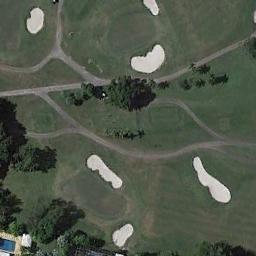

## RS-M-CLIP: Multilingual Vision-Language Pre-training for the Remote Sensing Domain

This is the official repository for the article titled “[Multilingual Vision-Language Pre-training for the Remote Sensing Domain](https://arxiv.org/abs/2410.23370)"

#### Authors:

João Daniel Silva, INESC-ID , Instituto Superior Técnico, University of Lisbon

João Magalhães, NOVA-LINCS, Faculty of Science and Technology, NOVA University

Devis Tuia, ECEO, Ecole Polytechnique Fédérale de Lausanne

Bruno Martins, INESC-ID & LUMLIS, Instituto Superior Técnico, University of Lisbon

### Abstract

> Methods based on Contrastive Language-Image Pre-training (CLIP) are nowadays extensively used in support of vision-and-language tasks involving remote sensing data, such as cross-modal retrieval. The adaptation of CLIP to this specific domain has relied on model fine-tuning with the standard contrastive objective, using existing human-labeled image-caption datasets, or using synthetic data corresponding to image-caption pairs derived from other annotations over remote sensing images (e.g., object classes). The use of different pre-training mechanisms has received less attention, and only a few exceptions have considered multilingual inputs. This work proposes a novel vision-and-language model for the remote sensing domain, exploring the fine-tuning of a multilingual CLIP model and testing the use of a self-supervised method based on aligning local and global representations from individual input images, together with the standard CLIP objective. Model training relied on assembling pre-existing datasets of remote sensing images paired with English captions, followed by the use of automated machine translation into nine additional languages. We show that translated data is indeed helpful, e.g. improving performance also on English. Our resulting model, which we named Remote Sensing Multilingual CLIP (RS-M-CLIP), obtains state-of-the-art results in a variety of vision-and-language tasks, including cross-modal and multilingual image-text retrieval, or zero-shot image classification.

### Description

(**R**emote **S**ensing **M**ultilingual **CLIP**) RS-M-CLIP is a CLIP-based model for the Remote Sensing Domain. We improve the performance of CLIP without scaling the amount of training data by using an aggregation of available datasets with image-caption pairs, included a self-distillation method together with the contrastive learning objective, and used captions translated in different languages. We started training from a CLIP model with a multilingual text encoder, with a vision encoder ViT-B: https://huggingface.co/laion/CLIP-ViT-B-32-xlm-roberta-base-laion5B-s13B-b90k. Our model achieves state-of-the art results for cross-modal image-text retrieval, and has multilingual abilities, being able to process other languages than English.

Languages supported: English, Portuguese, Spanish, French, German, Dutch, Italian, Chinese, Korean, and Russian.

You can download RS-M-CLIP from the huggingface-hub repo: https://huggingface.co/joaodaniel/RS-M-CLIP

### Code Examples

To load the model, the OpenCLIP library will load the weights that are stored in the huggingface hub.

```python
import torch
import open_clip

model, preprocess, preprocess_val = open_clip.create_model_and_transforms('hf-hub:joaodaniel/RS-M-CLIP')
tokenizer = open_clip.get_tokenizer('hf-hub:joaodaniel/RS-M-CLIP')
```

#### Image Classification (in English)

The following is an example of image classification with text queries in English.

```python
model = model.eval()

from PIL import Image
image = preprocess(Image.open('figs/airplane_004.jpg')).unsqueeze(0)

text_queries = [ 
    "A residential area with houses.", 
    "Blocks of buildings can be seen in the factory .", 
    "Dense residential areas on both sides of the road .", 
    "Many airplanes in the open area.",
    "A cute cat",
    ]
text = tokenizer(text_queries)

with torch.no_grad():
    image_features = model.encode_image(image)
    text_features = model.encode_text(text)
    image_features /= image_features.norm(dim=-1, keepdim=True)
    text_features /= text_features.norm(dim=-1, keepdim=True)

    text_probs = (100.0 * image_features @ text_features.T).softmax(dim=-1).cpu().numpy()[0]

for query, prob in zip(text_queries, text_probs):
    print(f"{query:<40} {prob * 100:5.1f}%")
```

With the following output:
```
A residential area with houses.                                0.0%
Blocks of buildings can be seen in the factory .               0.0%
Dense residential areas on both sides of the road .            0.0%
Many airplanes in the open area.                             100.0%
A cute cat                                                     0.0%
```


<div align="center">
  
</div>

#### Image Classification (in Spanish)
```python
from PIL import Image
image = preprocess(Image.open('figs/golf_course_004.jpg')).unsqueeze(0)

text_queries = [
"Una zona residencial con casas.",
"Se pueden ver bloques de edificios en la fábrica.",
"Zonas residenciales densas a ambos lados de la carretera.",
"Muchos aviones en el área abierta.",
"Un lindo gato",
"Un campo de golf con bunkers."
]
text = tokenizer(text_queries)

with torch.no_grad():
    image_features = model.encode_image(image)
    text_features = model.encode_text(text)
    image_features /= image_features.norm(dim=-1, keepdim=True)
    text_features /= text_features.norm(dim=-1, keepdim=True)

    text_probs = (100.0 * image_features @ text_features.T).softmax(dim=-1).cpu().numpy()[0]

for query, prob in zip(text_queries, text_probs):
    print(f"{query:<60} {prob * 100:5.1f}%")
```

With the following output:
```
Una zona residencial con casas.                                0.0%
Se pueden ver bloques de edificios en la fábrica.              0.0%
Zonas residenciales densas a ambos lados de la carretera.      0.0%
Muchos aviones en el área abierta.                             0.0%
Un lindo gato                                                  0.0%
Un campo de golf con bunkers.                                100.0%
```

<div align="center">
  
</div>

### Citation

If you find our work useful 🙏, please cite us as:

```bibtex
@article{silva2024large,
  title={Multilingual Vision-Language Pre-training for the Remote Sensing Domain},
  author={Silva, Jo{\~a}o Daniel and Magalh{\~a}es, Jo{\~a}o and Tuia, Devis and Martins, Bruno},
  journal={arXiv:2410.23370},
  year={2024}
}
```
